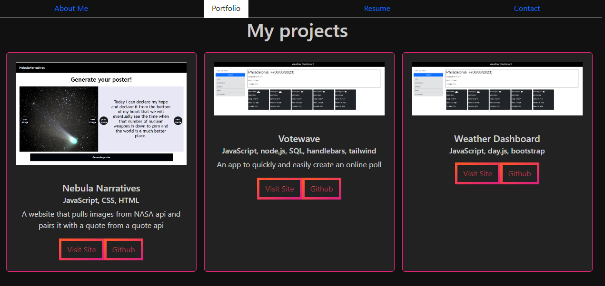

### React Portfolio

## Description

This is my project portfolio website. The front end was created using React. There is an about me section, portfolio section with 6 examples of my work, a section with my resume and list of technical skills, and also a page to leave contact information. It is deployed to netlify.

## Links

github: https://github.com/cdziedzic/React-Portfolio

Deployed website: https://cute-pavlova-43f29c.netlify.app/

## Screenshot

## Credit

Bootstrap cards and styling were created by a designer called Nikki Peel. They were acquired from the website freefrontend.com. Link to the cards: https://codepen.io/nikki-peel/pen/RwavQer

## License

## Questions

[My github](github.com/cdziedzic)

E-mail: cdziedzic@gmail.com